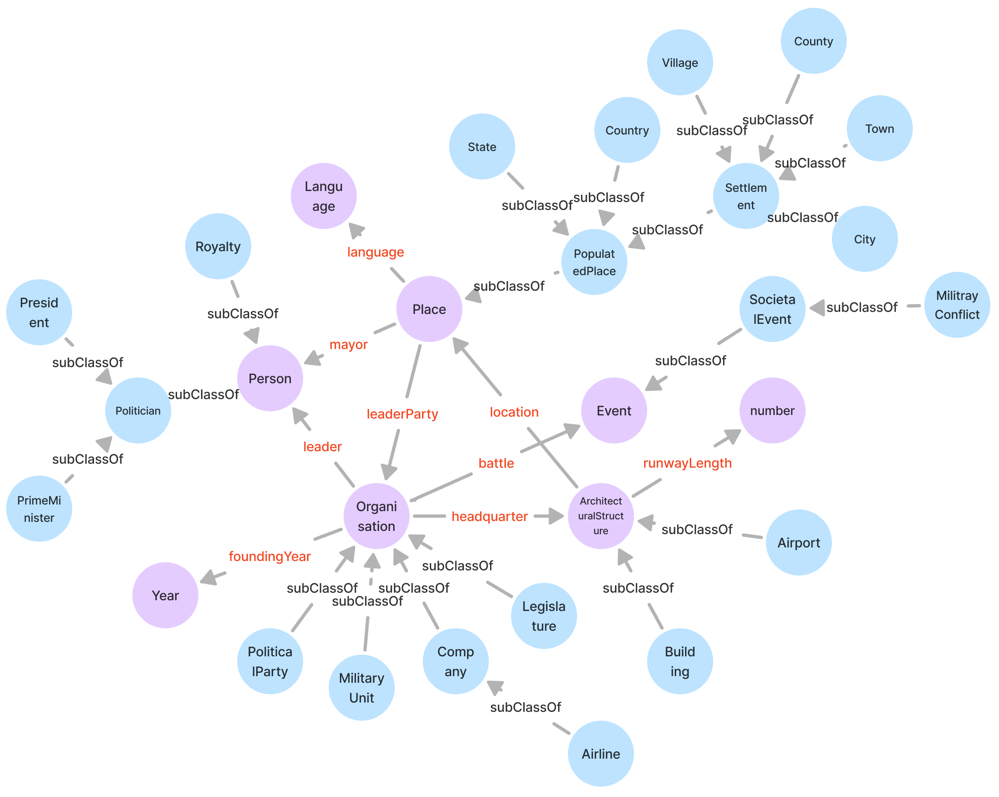

# OSKGC: A benchmark for Ontology Schema-based Knowledge Graph Construction from text

OSKGC is a benchmark dataset designed for knowledge graph construction based on a predefined ontology schema. The primary task formulation it supports is a novel setting proposed in our paper, where information is extracted from input text and constructed into a knowledge graph under the constraints of a predefined ontology schema. Unlike conventional knowledge graph construction tasks, OSKGC requires the constructed knowledge graph to maintain both textual accuracy and ontological structural conformity, necessitating evaluation at both triple-level and schema-level. This enables enriching existing knowledge graphs with new textual information without altering their fundamental structure. We provide baseline methods under both pipeline and joint extraction settings, experimenting with several mainstream locally-deployable LLMs and proprietary LLMs.

## Dataset Composition

The OSKGC benchmark consists of three core components:
1. Text-triple-schema data pairs
2. Predefined ontology schemas
3. A unified ontology hierarchy

Based on WebNLG's text-triple pairs, we performed fine-grained type annotation for entities using external knowledge from DBpedia and Wikipedia, and constructed subsumption hierarchies according to DBpedia ontology classes.

### Text-Triple-Schema Pairs [`benchmark/data`](./benchmark/data)

OSKGC utilizes text-triple pairs from WebNLG containing 1, 2, and 3 triples, totaling 10,183 text entries. These are divided into three groups by triple count, with each group further categorized into 19 thematic categories (57 total categories). The table below shows statistics for each category including text count, entity type count, and relation count. Each text entry is unique, with entity types and relations overlapping across categories, with a total of 207 and 382 respectively.

<table>
  <thead>
    <tr>
      <th rowspan="2">Category</th>
      <th colspan="3">1 triple</th>
      <th colspan="3">2 triples</th>
      <th colspan="3">3 triples</th>
    </tr>
    <tr>
      <th>Ontology</th>
      <th>Relation</th>
      <th>Text</th>
      <th>Ontology</th>
      <th>Relation</th>
      <th>Text</th>
      <th>Ontology</th>
      <th>Relation</th>
      <th>Text</th>
    </tr>
  </thead>
  <tbody>
    <tr>
      <td>Airport</td>
      <td>44</td>
      <td>54</td>
      <td>350</td>
      <td>42</td>
      <td>50</td>
      <td>240</td>
      <td>39</td>
      <td>35</td>
      <td>228</td>
    </tr>
    <tr>
      <td>Artist</td>
      <td>36</td>
      <td>44</td>
      <td>324</td>
      <td>36</td>
      <td>34</td>
      <td>276</td>
      <td>31</td>
      <td>30</td>
      <td>298</td>
    </tr>
    <tr>
      <td>Astronaut</td>
      <td>28</td>
      <td>37</td>
      <td>86</td>
      <td>23</td>
      <td>30</td>
      <td>67</td>
      <td>28</td>
      <td>36</td>
      <td>84</td>
    </tr>
    <tr>
      <td>Athlete</td>
      <td>46</td>
      <td>45</td>
      <td>326</td>
      <td>39</td>
      <td>31</td>
      <td>219</td>
      <td>32</td>
      <td>32</td>
      <td>258</td>
    </tr>
    <tr>
      <td>Building</td>
      <td>47</td>
      <td>39</td>
      <td>256</td>
      <td>47</td>
      <td>39</td>
      <td>195</td>
      <td>47</td>
      <td>37</td>
      <td>219</td>
    </tr>
    <tr>
      <td>CelestialBody</td>
      <td>11</td>
      <td>27</td>
      <td>196</td>
      <td>10</td>
      <td>25</td>
      <td>157</td>
      <td>11</td>
      <td>25</td>
      <td>153</td>
    </tr>
    <tr>
      <td>City</td>
      <td>23</td>
      <td>26</td>
      <td>279</td>
      <td>19</td>
      <td>21</td>
      <td>244</td>
      <td>22</td>
      <td>21</td>
      <td>256</td>
    </tr>
    <tr>
      <td>ComicsCharacter</td>
      <td>20</td>
      <td>20</td>
      <td>111</td>
      <td>18</td>
      <td>16</td>
      <td>94</td>
      <td>17</td>
      <td>19</td>
      <td>78</td>
    </tr>
    <tr>
      <td>Company</td>
      <td>33</td>
      <td>35</td>
      <td>104</td>
      <td>21</td>
      <td>21</td>
      <td>101</td>
      <td>21</td>
      <td>24</td>
      <td>99</td>
    </tr>
    <tr>
      <td>Film</td>
      <td>25</td>
      <td>33</td>
      <td>74</td>
      <td>18</td>
      <td>17</td>
      <td>41</td>
      <td>19</td>
      <td>22</td>
      <td>51</td>
    </tr>
    <tr>
      <td>Food</td>
      <td>48</td>
      <td>28</td>
      <td>271</td>
      <td>45</td>
      <td>25</td>
      <td>280</td>
      <td>43</td>
      <td>22</td>
      <td>310</td>
    </tr>
    <tr>
      <td>MeanOfTransportation</td>
      <td>41</td>
      <td>72</td>
      <td>333</td>
      <td>36</td>
      <td>66</td>
      <td>240</td>
      <td>36</td>
      <td>63</td>
      <td>249</td>
    </tr>
    <tr>
      <td>Monument</td>
      <td>23</td>
      <td>24</td>
      <td>38</td>
      <td>21</td>
      <td>20</td>
      <td>39</td>
      <td>23</td>
      <td>24</td>
      <td>49</td>
    </tr>
    <tr>
      <td>MusicalWork</td>
      <td>16</td>
      <td>28</td>
      <td>88</td>
      <td>12</td>
      <td>15</td>
      <td>49</td>
      <td>17</td>
      <td>22</td>
      <td>53</td>
    </tr>
    <tr>
      <td>Politician</td>
      <td>53</td>
      <td>46</td>
      <td>334</td>
      <td>46</td>
      <td>38</td>
      <td>281</td>
      <td>48</td>
      <td>39</td>
      <td>295</td>
    </tr>
    <tr>
      <td>Scientist</td>
      <td>29</td>
      <td>37</td>
      <td>73</td>
      <td>20</td>
      <td>23</td>
      <td>52</td>
      <td>25</td>
      <td>27</td>
      <td>50</td>
    </tr>
    <tr>
      <td>SportsTeam</td>
      <td>31</td>
      <td>29</td>
      <td>283</td>
      <td>28</td>
      <td>26</td>
      <td>199</td>
      <td>24</td>
      <td>23</td>
      <td>197</td>
    </tr>
    <tr>
      <td>University</td>
      <td>29</td>
      <td>40</td>
      <td>71</td>
      <td>25</td>
      <td>31</td>
      <td>59</td>
      <td>29</td>
      <td>41</td>
      <td>72</td>
    </tr>
    <tr>
      <td>WrittenWork</td>
      <td>35</td>
      <td>49</td>
      <td>250</td>
      <td>32</td>
      <td>42</td>
      <td>230</td>
      <td>30</td>
      <td>40</td>
      <td>274</td>
    </tr>
  </tbody>
</table>

The following is an example entry:

```xml
<entry category="3_Airport" id="3_Airport_train_28">
  <text>Allama Iqbal International Airport serves the city of Lahore which is in Pakistan where Nawaz Sharif is the leader.</text>
  <triples>
    <triple>
      <sub>Lahore</sub>
      <rel>country</rel>
      <obj>Pakistan</obj>
    </triple>
    <triple>
      <sub>Allama_Iqbal_International_Airport</sub>
      <rel>serves</rel>
      <obj>Lahore</obj>
    </triple>
    <triple>
      <sub>Pakistan</sub>
      <rel>leader</rel>
      <obj>Nawaz_Sharif</obj>
    </triple>
  </triples>
  <schemas>
    <schema>
      <sub>City</sub>
      <rel>country</rel>
      <obj>Country</obj>
    </schema>
    <schema>
      <sub>Airport</sub>
      <rel>serves</rel>
      <obj>City</obj>
    </schema>
    <schema>
      <sub>Country</sub>
      <rel>leader</rel>
      <obj>PrimeMinister</obj>
    </schema>
  </schemas>
</entry>
```
- **`<text>`**: contains textual information  
- **`<triples>`**: defines a set of triples in `(subject, relation, object)` format  
- **`<schemas>`**: defines corresponding ontology schemas in `(subject type, relation, object type)` format  
- **Alignment**: Triples and schemas maintain strict one-to-one positional correspondence  

In our task formulation:  
- Text serves as model input  
- Triples and schemas serve as golden labels for:  
  - Triple-level factual accuracy evaluation  
  - Schema-level structural conformity evaluation  

### Predefined Ontology Schemas [`benchmark/ontology`](./benchmark/ontology)

For each category, a dedicated ontology schema is constructed to guide knowledge graph construction under the domain. These schemas contain entity types, their relations, and hierarchical structures within each category.

A sample (partial) ontology schema:



#### An ontology schema consists of:
1. **Core Structure** (Purple nodes):  
   - Root-level entity types  
   - Category-specific relations  

2. **Hierarchical Structure** (Blue nodes):  
   - Fine-grained entity types  
   - Connected to core structure via root nodes  

### Hierarchical Structure [`benchmark/hierarchy.xml`](./benchmark/hierarchy.xml)

While relation structures vary by category, all hierarchies follow a standardized framework based on DBpedia ontology classes. This XML file provides the unified subsumption hierarchical structure used throughout OSKGC. 

## Baseline Experiments

We conducted baseline experiments under both pipeline and joint extraction settings, testing OSKGC with mainstream LLMs. Both settings automatically generate prompts based on configuration files. The pipeline approach decomposes prompts into three steps: entity recognition, entity typing, and relation selection. Our code supports loading LLMs, automatic prompt generation, and performance evaluation.

### Requirements
- Python ≥ 3.8
- PyTorch ≥ 2.1.0

### Install dependencies:
```bash
pip install -r requirements.txt
```
### Configuration
1. Modify `config.yaml` to set experiment parameters (pipeline/joint extraction, one-shot example selection, etc.)
2. For proprietary LLM API usage, configure `config_api.yaml`

### Execution Commands
Run model only:
- Local LLMs:
```bash
python main.py --config config.yaml --do run
```
- Proprietary LLMs:
```bash
python main.py --config config.yaml --api-config config_api.yaml --do run
```
Run model with evaluation:
- Local LLMs:
```bash
python main.py --config config.yaml --do both
```
- Proprietary LLMs:
```bash
python main.py --config config.yaml --api-config config_api.yaml --do both
```
Evaluate only:
- Local LLMs:
```bash
python main.py --config config.yaml --do evaluate
# or
python evaluate.py --config config.yaml
```
- Proprietary LLMs:
```bash
python main.py --config config.yaml --api-config config_api.yaml --do evaluate
# or
python evaluate.py --config config.yaml --api-config config_api.yaml
```
## Baseline Results
We provide:
- Raw LLM outputs: [`LLM_response/`](./LLM_response/)
- Evaluation results: [`evaluation_results/`](./evaluation_results/)


### Baseline results with the pipeline setting: 
(The terms "random" or "sbert" following the model name refer to the method used for selecting examples in the prompt)
| Baseline model        | Precision ↑ | Recall ↑ | Micro F1 ↑  | Macro F1 ↑ | SS ↑  |
|------------------|-------------|----------|-------|-------------|--------|
| llama3-8b random    | 0.328       | 0.483    | 0.391 | 0.347       | 0.161  |
| llama3-8b sbert   | 0.464       | 0.683    | 0.553 | 0.493       | 0.264  |
| qwen2.5-7b random   | 0.417       | 0.660    | 0.511 | 0.529       | 0.351  |
| qwen2.5-7b sbert  | 0.544       | 0.801    | 0.648 | 0.649       | 0.485  |
| phi3-small random    | 0.241       | 0.513    | 0.328 | 0.346       | 0.161  |
| phi3-small sbert    | 0.349       | 0.685    | 0.463 | 0.46       | 0.299  |
| mistral-7b random    | 0.299       | 0.538    | 0.385 | 0.403       | 0.212  |
| mistral-7b sbert    | 0.464       | 0.758    | 0.576 | 0.571       | 0.381  |
| gpt-4o random    | 0.55       | 0.75    | 0.635 | 0.634       | 0.519  |
| gpt-4o sbert    | 0.673       | 0.851    | 0.751 | 0.745       | 0.658  |
| gemini 1.5 pro random    | 0.465       | 0.617    | 0.531 | 0.486       | 0.433  |
| gemini 1.5 pro sbert    | 0.6       | 0.806    | 0.688 | 0.661       | 0.597  |
| claude 3.5 sonnet random    | 0.494       | 0.694    | 0.577 | 0.576       | 0.466  |
| claude 3.5 sonnet sbert    | 0.602       | 0.835    | 0.7 | 0.702       | 0.584  |

### Baseline results with the joint extraction setting:
| Baseline model      | Precision↑ | Recall↑ | Micro F1↑   | Macro F1↑ | SS↑   |
|--------------------|------------|---------|-------|-----------|-------|
| llama3-8b random  | 0.274      | 0.693   | 0.393 | 0.481     | 0.107 |
| llama3-8b sbert   | 0.392      | 0.815   | 0.53  | 0.601     | 0.228 |
| qwen2.5-7b random  | 0.423      | 0.742   | 0.539 | 0.582     | 0.158 |
| qwen2.5-7b sbert   | 0.572      | 0.861   | 0.687 | 0.701     | 0.44  |
| phi3-small random  | 0.388      | 0.7     | 0.499 | 0.551     | 0.19  |
| phi3-small sbert   | 0.485      | 0.812   | 0.607 | 0.627     | 0.423 |
| mistral-7b random  | 0.353      | 0.677   | 0.464 | 0.518     | 0.259 |
| mistral-7b sbert   | 0.479      | 0.821   | 0.605 | 0.646     | 0.471 |
| gpt-4o random  | 0.596      | 0.803   | 0.684 | 0.693     | 0.404 |
| gpt-4o sbert   | 0.694      | 0.893   | 0.781 | 0.766     | 0.627 |
| gemini 1.5 pro random  | 0.58       | 0.805   | 0.674 | 0.682     | 0.58  |
| gemini 1.5 pro sbert   | 0.679      | 0.871   | 0.763 | 0.763     | 0.691 |
| claude 3.5 sonnet random  | 0.601      | 0.838   | 0.7   | 0.705     | 0.482 |
| claude 3.5 sonnet sbert   | 0.682      | 0.9     | 0.776 | 0.786     | 0.619 |

The above baseline results offer a reference for future research and comparisons within the community.

## License

### 📦 Code

All source code in this repository is licensed under the [MIT License](./LICENSE).

### 📊 Data

The dataset located in the [`benchmark/`](./benchmark) directory are licensed under the 
[Creative Commons Attribution-NonCommercial-ShareAlike 4.0 International License](https://creativecommons.org/licenses/by-nc-sa/4.0/).


